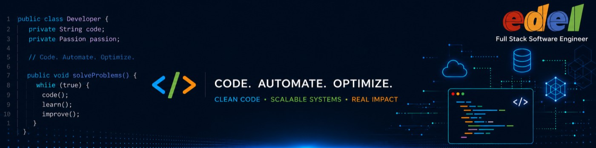

  

# 👋 Hi, I'm Edel Agüero M

  

### Full Stack Engineer | Cloud Solutions Architect | DevOps & Automation | University Teach Teacher

Building scalable applications, cloud-native solutions and modern software architectures.

## 🚀 About Me

I'm a Full Stack Software Engineer passionate about solving complex business challenges through technology.

Over the years, I've worked across the entire software development lifecycle, from architecture and infrastructure design to backend services, frontend applications, cloud platforms, and DevOps automation.

My expertise includes building scalable cloud-native solutions using Java, Node.js, Python, React, Angular, AWS, Azure, Kubernetes, and Terraform.

I enjoy designing systems that are reliable, maintainable, and capable of supporting business growth at scale.

🌎 Costa Rica | Remote First

---

## 🛠️ Tech Stack

### Backend

### Modern Frontend Architecture

### Mobile

### Cloud & DevOps

### Databases & Messaging

## 🏆 Certifications

- AWS Certified Solutions Architect (In Progress)
- AWS Certified Cloud Practitioner
- Flutter Certified Application Developer
- Professional Scrum Master™ I (PSM I)

---
## 🏛️ Architecture Interests

- Microservices
- Front End
- Event Driven Architecture
- Domain Driven Design (DDD)
- Serverless Solutions
- Cloud Native Applications
- CI/CD Pipelines

## 🚀 What I'm Building

### 🐾 Pet Services Platform
A cloud-native SaaS platform connecting pet owners with veterinary clinics and pet service providers.

### 📱 Multi-Channel Messaging Platform
A white-label SaaS solution integrating WhatsApp, Instagram and Messenger APIs for business communications.

---
## 📊 GitHub Stats

  
  

---
## 🌐 Connect With Me

📍 Costa Rica

🌎 https://edelaguero.com

💼 https://linkedin.com/in/edel-aguero

📧 Contact through LinkedIn

---

### "DESIGN. BUILD. SCALE."

